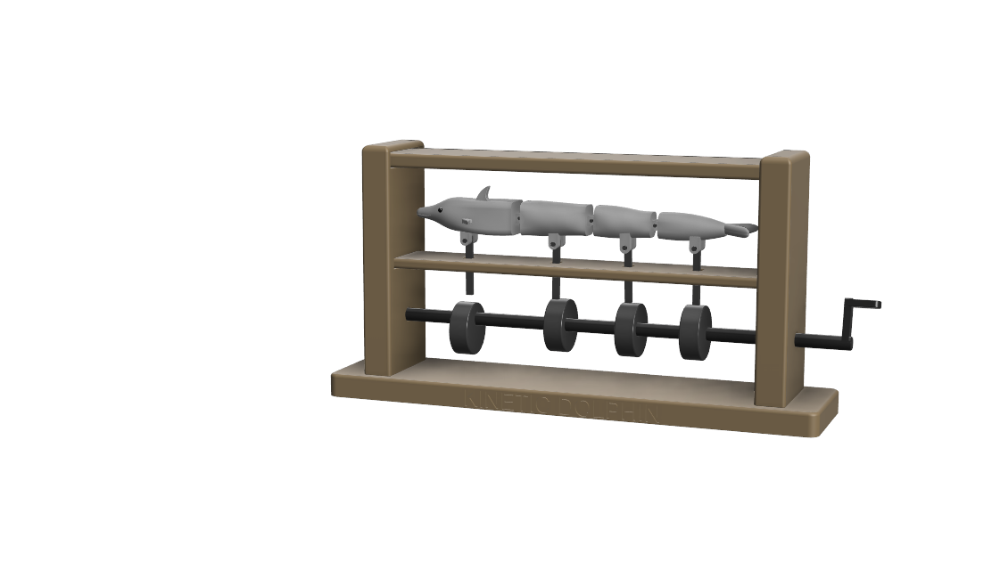
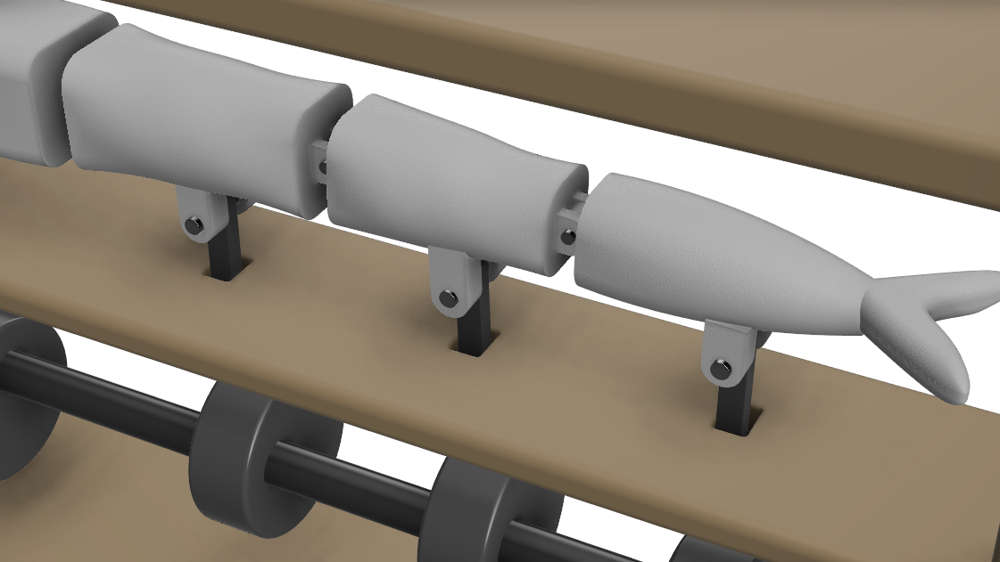
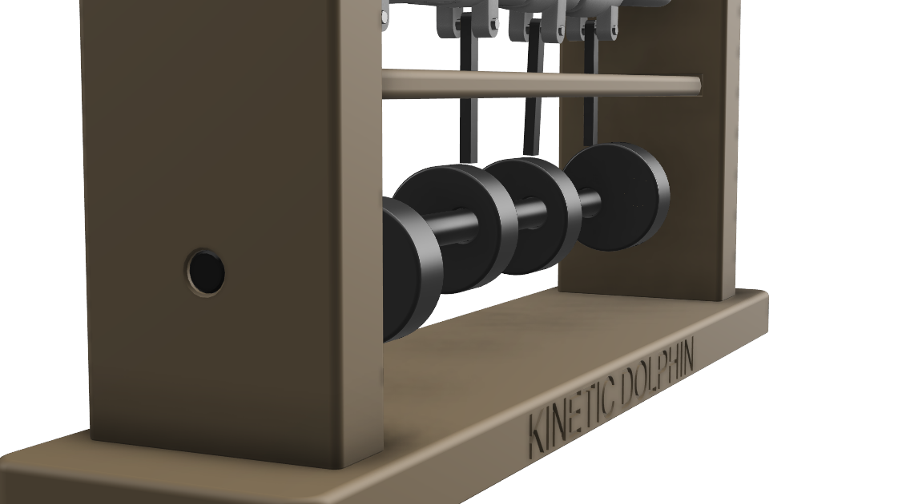
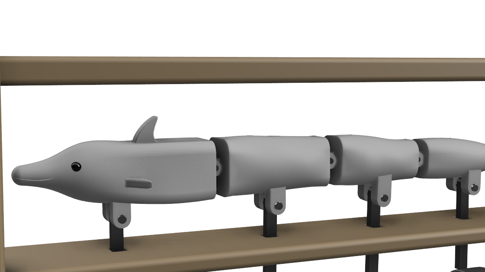
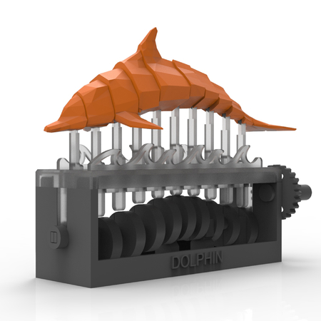

# Kinetic Dolphin

> A 3D-printed mechanical sculpture that simulates dolphin swimming using a cam-driven mechanism — no electronics, no motors, no code.

**100% Mechanical** · **4 Cam Offsets** · **PLA / PETG** · **Manual Crank** · **CAD & 3D Printing Final Project**

---

## Description

**Kinetic Dolphin** converts rotational motion into a smooth, sequential wave-like movement of a segmented dolphin body. The user turns a crank, which rotates a central shaft carrying four cams. Each cam is offset by 90°, causing body segments to move one after another — simulating natural swimming.

---
## Pictures


### CAD Render










## How It Works

```
Turn the crank
      ↓
Central shaft rotates
      ↓
4 cams push followers at staggered moments
      ↓
Followers move vertically (up/down)
      ↓
Body segments rotate sequentially
      ↓
Wave-like swimming motion
```

---

## Project Goals

- Understand cam-based mechanisms
- Convert rotation into vertical follower motion
- Design articulated body segments
- Create parts suitable for 3D printing
- Assemble a functional mechanical system
- Test tolerances and clearances between printed parts

---

## Repository Structure

```
📁 Project/
   ├── kinetic-dolphin.f3d          ← Fusion 360 source file
   ├── STL/                         ← All printable parts as .stl
   └── GCODE/                       ← Sliced files ready for printing
📁 Sketches/                        ← Early sketches and ideation
📁 images/                          ← CAD screenshots and photos
    Final Project Requirements.pdf
    README.md
```

---

## Project Files

### Fusion 360 Source
| File | Description |
|------|-------------|
| `Project/kinetic-dolphin.f3d` | Full Fusion 360 assembly |

### STL Files

All printable components were exported as a single STL file containing the full assembly:

| File | Description |
|------|-------------|
| `Project/STL/Kinetic_Dolphin_All_Parts.stl` | Full assembly — all printable components |

The individual components in Fusion 360 that make up this file are:

| Component (Fusion 360) | Description |
|------------------------|-------------|
| `Frame_Base` | Main frame base |
| `Left_Column` | Left support column |
| `Right_Column` | Right support column |
| `Top_Bar` | Top bar connecting the two columns |
| `Central_Shaft` | Central rotating shaft |
| `Cam_01_0deg` | Cam 1 — 0° offset (Head) |
| `Cam_02_90deg` | Cam 2 — 90° offset (Middle 1) |
| `Cam_03_180deg` | Cam 3 — 180° offset (Middle 2) |
| `Cam_04_270deg` | Cam 4 — 270° offset (Tail) |
| `Follower_01` – `Follower_04` | Vertical followers (×4) |
| `Dolphin_Head` | Head segment |
| `Dolphin_Segment_01` / `Dolphin_Segment_02` | Middle body segments |
| `Dolphin_Tail_Segment` | Tail segment |
| `Top_Spine_Rod` | Spine rod along top of body |
| `Hinge_Pin_01` – `HingePin04` | Hinge pins for body segments (×4) |
| `Hinge_Pin_02_03` | Hinge pin between segments (×3) |
| `Pin_Guide_Lower_Support` | Lower guide support for follower pins |
| `CMP_L_Shaped_Crank_Handle` | L-shaped crank handle |

### G-Code Files
| File | Description |
|------|-------------|
| `Project/GCODE/Frame_Base.gcode` | Sliced — frame base |
| `Project/GCODE/Columns_Top_Bar.gcode` | Sliced — left column, right column, top bar |
| `Project/GCODE/Central_Shaft.gcode` | Sliced — central shaft |
| `Project/GCODE/Cams.gcode` | Sliced — all 4 cams |
| `Project/GCODE/Followers.gcode` | Sliced — all 4 followers |
| `Project/GCODE/Body_Segments.gcode` | Sliced — head, 2× middle, tail |
| `Project/GCODE/Spine_and_Pins.gcode` | Sliced — spine rod + all hinge pins |
| `Project/GCODE/Crank_Handle.gcode` | Sliced — L-shaped crank handle |

---

## Main Components

| Part | Qty | Role |
|------|-----|------|
| `CMP_L_Shaped_Crank_Handle` | ×1 | Manual input — rotates the mechanism |
| `Central_Shaft` | ×1 | Transfers rotation to all cams |
| `Cam_01_0deg` – `Cam_04_270deg` | ×4 | Push followers at staggered 90° intervals |
| `Follower_01` – `Follower_04` | ×4 | Convert cam rotation into vertical motion |
| `Dolphin_Head` | ×1 | Front body segment — first to move |
| `Dolphin_Segment_01` / `Dolphin_Segment_02` | ×2 | Middle body segments |
| `Dolphin_Tail_Segment` | ×1 | Rear segment — last to move |
| `Top_Spine_Rod` | ×1 | Structural rod along the top of the dolphin body |
| `Hinge_Pin_02_03` | ×3 | Connect adjacent body segments (revolute joint) |
| `Hinge_Pin_01` – `HingePin04` | ×4 | Connect followers to body segments |
| `Pin_Guide_Lower_Support` | ×1 | Guides the lower end of follower pins |
| `Frame_Base` | ×1 | Ground plate — provides stability |
| `Left_Column` + `Right_Column` + `Top_Bar` | ×3 | Frame structure — supports and aligns the mechanism |

---

## Mechanical Design

### Body Segments

The dolphin body is divided into four articulated segments:

1. **Head / front body segment**
2. **Middle body segment 1**
3. **Middle body segment 2**
4. **Tail segment**

Segments are connected with hinge pins, allowing each section to rotate slightly relative to the next.

### Joint Types

| Connection | Joint Type |
|------------|------------|
| Frame to ground | Fixed / grounded |
| Central shaft to frame | Revolute joint |
| Cams to shaft | Rigid connection |
| Followers to frame | Slider joint (vertical only) |
| Segment to segment | Revolute joint (hinge pins) |
| Follower to segment | Revolute joint (follower pins) |
| Cam to follower | Contact surface |

---

## Cam Phase Offsets

Each cam is offset from the previous by 90°, creating a wave that travels from head to tail:

| Cam | Offset | Segment |
|-----|--------|---------|
| Cam 1 | 0° | Head |
| Cam 2 | 90° | Middle 1 |
| Cam 3 | 180° | Middle 2 |
| Cam 4 | 270° | Tail |

```
Cam 1:  0°  →  ●───
Cam 2: 90°  →  ───●
Cam 3: 180° →  ───●
Cam 4: 270° →  ●───
```

---

## Recommended Dimensions

| Element | Value |
|---------|-------|
| Hinge pin diameter | 2.0 mm |
| Hinge hole diameter | 2.4 mm |
| Follower pin diameter | 2.0 mm |
| Follower hole diameter | 2.4 mm |
| Clearance between moving parts | 0.3 – 0.6 mm |
| Space between body segments | 1 – 1.5 mm |
| Follower vertical travel | ~5 – 6 mm |
| Body segment rotation limit | ±12° to ±15° |

> **Note:** Holes are always 0.4 mm larger than pins to allow free movement after 3D printing.

---

## Print Orientation & Printability Notes

Each component was designed with printing orientation in mind to minimise supports and maximise strength:

| Part | Recommended Orientation | Supports Needed | Notes |
|------|------------------------|-----------------|-------|
| `Frame_Base` | Flat on bed | None | Large flat bottom — no supports required |
| `Left_Column` / `Right_Column` | Upright | Minimal | Vertical walls print cleanly |
| `Top_Bar` | Flat on bed | None | Low profile, no overhangs |
| `Central_Shaft` | Horizontal along X axis | None | Cylindrical — no overhangs when laid flat |
| `Cam_01`–`Cam_04` | Flat (lobe facing up) | None | Chamfered edges reduce elephant foot |
| `Follower_01`–`Follower_04` | Vertical (guide slot up) | None | Avoids support inside the guide channel |
| `Dolphin_Head` / segments | Flat on belly side | Minimal | Filleted edges reduce stringing |
| `Top_Spine_Rod` | Horizontal | None | Thin rod — lay flat for strength |
| Hinge pins | Vertical | None | Small cylinders — upright for best layer bonding |
| `CMP_L_Shaped_Crank_Handle` | Upright | None | Chamfer at base for clean bed adhesion |

> **General rules applied:**
> - All pin holes include 0.4 mm clearance to account for FDM shrinkage
> - Edges are chamfered / filleted throughout to improve layer adhesion at corners
> - No single component exceeds a standard 220 × 220 mm build plate
> - Bodies are split into separate components so each can be oriented independently

---

## Design Decisions

### Segmented body
Split into 4 separate parts instead of one solid piece — enables the realistic bending motion that simulates swimming.

### Pin-based hinges
Simple, printable, and allows controlled rotation between adjacent segments without complex mechanisms.

### Cam & follower mechanism
Reliable transformation of rotational motion into vertical movement. Offsetting the cams makes the motion sequential rather than simultaneous.

### Individual followers
One follower per segment gives independent, precise control over each body section.

### Manual crank
Fully mechanical, easy to demonstrate, and requires no electronics or batteries.

---

## Implementation Challenges

### 1. Segment alignment
Keeping segments aligned while still allowing rotation. A long rod through the entire body was too rigid — individual hinge pins between segments was the solution.

### 2. Smooth wave motion
If all cams are aligned identically, all followers move at once and the dolphin doesn't appear to swim. Correct 90° offsets travel the motion from head to tail.

### 3. Follower guidance
Followers must move only vertically. Without proper guides they tilt and block movement. Each requires a vertical slider constraint.

### 4. 3D print tolerances
Multiple moving parts make tolerances critical. Holes at 2.4 mm for 2.0 mm pins — the 0.4 mm clearance allows free rotation after printing.

### 5. Avoiding rigid connections
Followers must not be fixed rigidly to body segments. Revolute joints via small pins let each segment rotate naturally through its range.

---

## Assembly Steps

1. Print the frame and base
2. Insert the central shaft through the frame
3. Attach all four cams to the shaft at correct angular offsets
4. Mount the crank handle on one end of the shaft
5. Add the four vertical followers above the cams
6. Assemble the dolphin body segments using hinge pins
7. Connect each follower to its corresponding segment via follower pins
8. Check that all moving parts rotate or slide freely
9. Turn the crank and observe the wave-like swimming motion

---

## Expected Motion

When the crank is turned:

```
Segment 1 (Head)   → moves first
Segment 2 (Mid 1)  → follows
Segment 3 (Mid 2)  → follows
Segment 4 (Tail)   → moves last
```

The result is a mechanical wave travelling through the dolphin body from head to tail.

---

## Materials & Tools

- PLA or PETG filament
- 3D printer
- Autodesk Fusion 360 (CAD & motion study)
- PrusaSlicer / Cura (slicing)
- Small metal or printed pins (2.0 mm diameter)
- Sandpaper or file for cleaning holes
- Optional lubricant for smoother movement
- Optional metal rod for the central shaft

---

## Demo Video

> 🎬 **[Watch the motion study and assembly walkthrough on YouTube →](https://youtube.com/YOUR_LINK_HERE)**

The video showcases:
- Fusion 360 motion link animation (cam rotation → follower movement → wave motion)
- Full assembly sequence in CAD
- Expected swimming motion when the crank is turned
  

## Current Status

### Completed
- Main frame and base
- Central shaft
- Four cams (with correct 90° offsets)
- Four followers
- Four dolphin body segments
- Hinge connections between body segments
- Follower-to-segment pin connections
- Top spine rod
- Pin guide lower support
- L-shaped crank handle

---


## References

- [Save the Whales Kinetic Sculpture](https://www.youtube.com/watch?v=XO6ccPXwV70) — YouTube inspiration
- [Kinetic Whale](https://www.thingiverse.com/thing:3932765) — Thingiverse mechanism reference
- [Save the Whales](https://www.myminifactory.com/object/3d-print-save-the-whales-kinetic-whales-59557) — MyMiniFactory reference
- [Cam Mechanism Examples](https://www.printables.com/model/490289-cam-mechanism-examples) — Printables reference
- Autodesk Fusion 360 — CAD & motion study software
- PrusaSlicer / Cura — slicing software

---
## Pictures



----


  

## Credits

Designed and built as a final project for the **CAD & 3D Printing** university course — Unibuc Robotics 2025–2026.  
Inspired by kinetic animal sculptures and cam-driven mechanical models.
